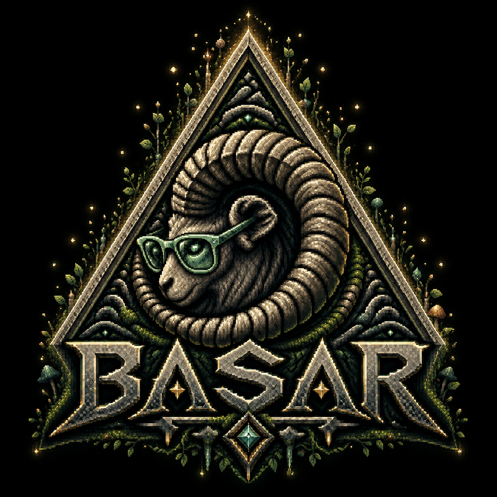

# Basar



**Basar is a multi-AI evidence workspace powered by 0G.**

Add sources once. Review with many AIs. Keep the evidence.

Ask multiple 0G AI models the same question over the same sources, compare
their answer cards, preserve citations, and export or publish a portable growth
package.

Basar is built for people who do not want truth, memory, or research infrastructure to depend on a single model, platform, institution, search engine, API gateway, or company.

It preserves trails back to evidence, scores sources with explainable rubrics, and answers research questions only from retrieved local or user-selected sources.

The project is also designed to encourage meaningful participation in the 0G ecosystem: using 0G-compatible AI inference, contributing source collections, experimenting with decentralized storage workflows, and turning real research archives into useful network activity.

## Zero Cup Submission

**Project title:** Basar — Multi-AI Evidence Workspace Powered by 0G

**Short summary:** Basar lets users add lawful source text, send the same
evidence package to multiple AI profiles through 0G Router-compatible paths,
compare cited answer cards, and preserve the review as a portable growth
package.

**What 0G does in the app:** 0G Router is the active inference layer for the
Zero Cup recording path through a user-controlled local relay or another
CORS-compatible endpoint. The Router API key stays outside the browser; Basar
records provider/model/status metadata and can export or publish the resulting
`basar.growth-package.v1` package.

**Demo flow:** add sources, configure multiple 0G AI profiles, open the Review
workspace, run the parallel AI Bench review, compare answer cards, inspect the
0G proof panel, then export or publish the growth package.

**Local fallback:** Local mode is the offline fallback. The Zero Cup recording
path uses a local user-owned relay for live 0G Router inference.

- Submission audit: [docs/ZERO_CUP_SUBMISSION.md](docs/ZERO_CUP_SUBMISSION.md)
- 0G integration notes: [docs/0g-integration.md](docs/0g-integration.md)
- Demo script and sample sources: [examples/zero-cup](examples/zero-cup)
- Live demo target: https://rymqmcxg2b-bot.github.io/Basar/

## Why It Exists

Data Personalism treats data as memory, context, labor, dignity, agency, and the trace of human judgment.

Basar is a reflective infrastructure response to centralization risk. It aims to make research tools local-first, auditable, forkable, source-preserving, and community-extensible without relying on unverified political or conspiracy claims.

The goal is not to replace human judgment with an oracle. The goal is to give individuals and communities better tools to preserve evidence, compare claims, inspect sources, and build their own durable knowledge archives.

## Features

- Source Cards and Claim Cards with portable JSON schemas.
- Local SQLite metadata store with FTS5 search.
- Deterministic source quality scoring with reasons and warnings.
- Mock AI provider that works without paid APIs.
- OpenAI-compatible, Ollama-compatible, and 0G Compute provider scaffolds.
- AI Bench for parallel 0G Router reviews over the same evidence package.
- Local fallback plus 0G Router through CORS-compatible or user-owned relay paths.
- FastAPI API, CLI, and browser-local Vite web UI.
- Public static web mode for local source work, evidence packages, export, and optional CORS-compatible endpoints.
- 0G growth packages for user-contributed source collections.
- Export support for source and claim cards.

## 0G-First Direction

Basar treats 0G not only as an AI compute provider, but as a coordination layer for user-owned knowledge infrastructure.

The project encourages users to preserve source collections, run retrieval-based research workflows, test 0G-compatible LLM inference, and contribute reusable archive packages that create practical demand for decentralized AI compute and storage.

Instead of empty token consumption, Basar focuses on meaningful usage: research, preservation, verification, education, and community memory.

### Browser, Router, and Direct

- Router path: best for server-side apps, agents, CLIs, prototypes, self-hosted deployments, and user-controlled relays.
- Static browser path: local-first workspace, source cards, evidence packages, export, and optional CORS-compatible endpoints.
- Direct path: future browser dApp direction where the user wallet signs requests.
- The Zero Cup recording uses a local user-owned relay so the 0G Router key stays outside the browser.

## Quickstart

```bash
python -m pip install -e 'apps/api[test]'
python -m pip install -e apps/cli --no-deps
basar doctor
basar demo
basar status
python -m pytest apps/api apps/cli
```

See the [CLI guide](docs/cli.md) for custom database paths, source search,
JSON export, and 0G archive dry-runs.

Run the API:

```bash
uvicorn basar_api.main:app --reload
```

Run the web UI:

```bash
cd apps/web
npm install
npm run smoke:zero-cup
npm run dev
```

The public web build is static and does not call this developer machine or a
shared backend. Users can add sources, run local fallback reviews, and export
growth packages from browser storage. For live 0G Router inference, use a
CORS-compatible endpoint or a user-controlled server-side/local relay because
Router API keys are server-side credentials.

Run the optional local API with Docker Compose:

```bash
docker compose up
```

Docker Compose is for local development only. The public web demo is static;
live Router inference should go through a CORS-compatible endpoint, a
user-controlled local relay, or the future Direct wallet-signed browser path.

## Principles

1. Do not outsource truth to a single model.
2. Preserve trails back to evidence.
3. Prefer primary sources where possible.
4. Distinguish facts, claims, interpretations, opinions, and predictions.
5. Store provenance, timestamps, URLs, local paths, content hashes, and quality reasons.
6. Local-first by default.
7. 0G participation is user-owned: users choose their own Router, storage, and credentials.
8. Model-provider and storage-provider agnostic.
9. Source scoring must be explainable.
10. AI outputs must cite retrieved sources.

## Data Governance

Do not commit copyrighted books, paywalled articles, private documents, scraped private data, user archives, API keys, wallet secrets, cookies, or tokens. Example data must be public domain, CC0, self-authored, or small synthetic examples. Users are responsible for the legality of materials they ingest locally.

This project provides preservation, indexing, metadata, source scoring, and citation tools. It is not a pirate library.

## Current 0G Support

The public web UI is 0G-first and user-owned: users package source collections
for 0G-oriented storage workflows and can point AI profiles at
CORS-compatible endpoints. Live 0G Router recording uses a local user-owned
relay so Router API keys stay outside the browser. Browser-native 0G operation
should use the future Direct wallet-signed flow. The API remains available for
local development and self-hosted deployments.

## Non-Goals

Basar is not a piracy platform, copyrighted PDF dump, propaganda engine, harmful-use chatbot, replacement for human source criticism, model-training project from scratch, or centralized SaaS.

## Licenses

Code is licensed under Apache-2.0. Documentation is intended for CC BY 4.0. Example data is CC0/public-domain-only.

Model licenses and dataset licenses are separate from this software license. Do not assume compatible models or datasets are open-source.

## Community Handoff

The founder-led alpha ends at the public MVP. Long-term maintenance is intended to be community-led through maintainers, RFC issues for schema changes, and security-conscious review.
