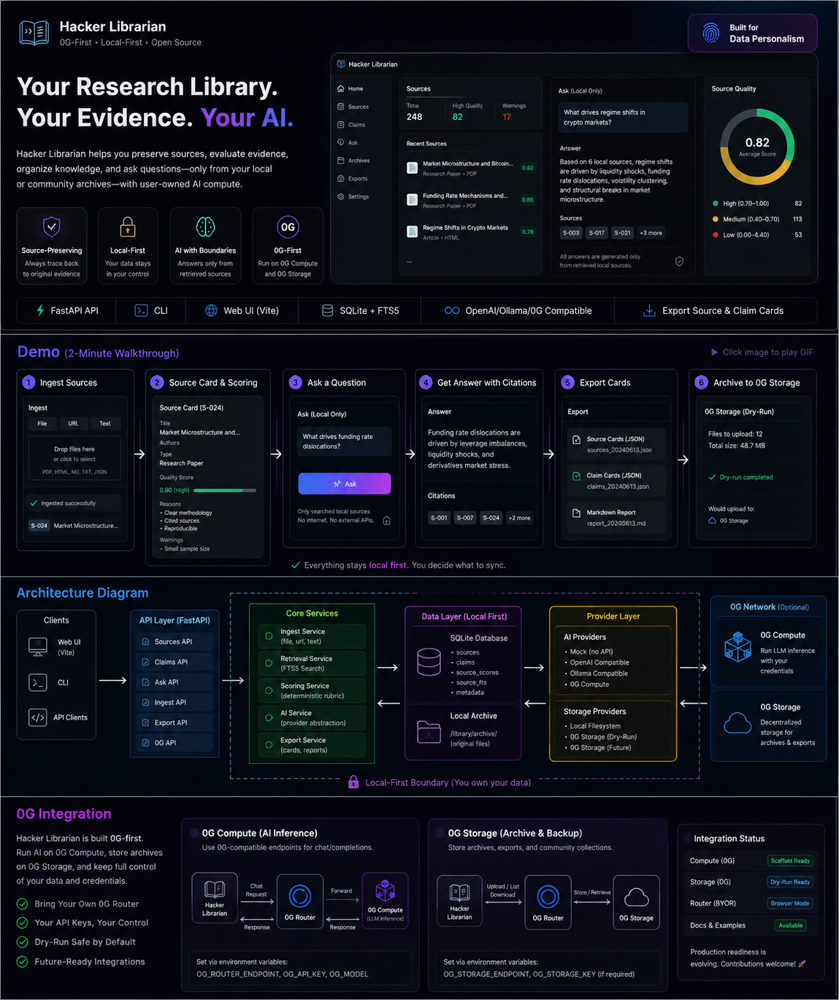

# Basar



**A 0G-first, local-first, open-source research librarian for preserving sources, evaluating evidence, organizing knowledge, and querying personal or community archives with user-owned AI compute.**

Basar is built for people who do not want truth, memory, or research infrastructure to depend on a single model, platform, institution, search engine, API gateway, or company.

It preserves trails back to evidence, scores sources with explainable rubrics, and answers research questions only from retrieved local or user-selected sources.

The project is also designed to encourage meaningful participation in the 0G ecosystem: using 0G-compatible AI inference, contributing source collections, experimenting with decentralized storage workflows, and turning real research archives into useful network activity.

## Why It Exists

Data Personalism treats data as memory, context, labor, dignity, agency, and the trace of human judgment.

Basar is a reflective infrastructure response to centralization risk. It aims to make research tools local-first, auditable, forkable, source-preserving, and community-extensible without relying on unverified political or conspiracy claims.

The goal is not to replace human judgment with an oracle. The goal is to give individuals and communities better tools to preserve evidence, compare claims, inspect sources, and build their own durable knowledge archives.

## Features

- Source Cards and Claim Cards with portable JSON schemas.
- Local SQLite metadata store with FTS5 search.
- Deterministic source quality scoring with reasons and warnings.
- Mock AI provider that works without paid APIs.
- OpenAI-compatible, Ollama-compatible, and 0G Compute provider scaffolds.
- Optional 0G Storage dry-run adapter.
- FastAPI API, CLI, and browser-local Vite web UI.
- Public static web mode where users bring their own 0G Router credentials.
- 0G growth packages for user-contributed source collections.
- Export support for source and claim cards.

## 0G-First Direction

Basar treats 0G not only as an AI compute provider, but as a coordination layer for user-owned knowledge infrastructure.

The project encourages users to preserve source collections, run retrieval-based research workflows, test 0G-compatible LLM inference, and contribute reusable archive packages that create practical demand for decentralized AI compute and storage.

Instead of empty token consumption, Basar focuses on meaningful usage: research, preservation, verification, education, and community memory.

## Quickstart

```bash
python -m pip install -e 'apps/api[test]'
python -m pip install -e apps/cli --no-deps
basar doctor
basar demo
basar status
python -m pytest apps/api apps/cli
```

See the [CLI guide](docs/cli.md) for custom database paths, source search,
JSON export, and 0G archive dry-runs.

Run the API:

```bash
uvicorn basar_api.main:app --reload
```

Run the web UI:

```bash
cd apps/web
npm install
npm run dev
```

The public web build is static and does not call this developer machine or a
shared backend. Users can enter their own 0G Router endpoint, model, API key,
and storage endpoint in the browser UI. Source data is stored in the user's
browser storage by default, then can be exported or published as a 0G growth
package.

Run the optional local API with Docker Compose:

```bash
docker compose up
```

Do not expose local Docker Compose services for public use.

### Publication Checklist

- Run the [release checklist](docs/release-playbook.md) before publishing to GitHub or another platform.
- Keep credentials in environment variables only.
- Keep default database and archives local unless the user explicitly configures 0G backup.

## Principles

1. Do not outsource truth to a single model.
2. Preserve trails back to evidence.
3. Prefer primary sources where possible.
4. Distinguish facts, claims, interpretations, opinions, and predictions.
5. Store provenance, timestamps, URLs, local paths, content hashes, and quality reasons.
6. Local-first by default.
7. 0G participation is user-owned: users choose their own Router, storage, and credentials.
8. Model-provider and storage-provider agnostic.
9. Source scoring must be explainable.
10. AI outputs must cite retrieved sources.

## Data Governance

Do not commit copyrighted books, paywalled articles, private documents, scraped private data, user archives, API keys, wallet secrets, cookies, or tokens. Example data must be public domain, CC0, self-authored, or small synthetic examples. Users are responsible for the legality of materials they ingest locally.

This project provides preservation, indexing, metadata, source scoring, and citation tools. It is not a pirate library.

## Current 0G Support

The public web UI is 0G-first and user-owned: users configure their own 0G Router settings, package source collections for 0G-oriented storage workflows, and keep credentials in their own browser. The optional API remains available for local development and self-hosted deployments.

## Non-Goals

Basar is not a piracy platform, copyrighted PDF dump, propaganda engine, harmful-use chatbot, replacement for human source criticism, model-training project from scratch, or centralized SaaS.

## Licenses

Code is licensed under Apache-2.0. Documentation is intended for CC BY 4.0. Example data is CC0/public-domain-only.

Model licenses and dataset licenses are separate from this software license. Do not assume compatible models or datasets are open-source.

## Community Handoff

The founder-led alpha ends at the public MVP. Long-term maintenance is intended to be community-led through maintainers, RFC issues for schema changes, and security-conscious review.
